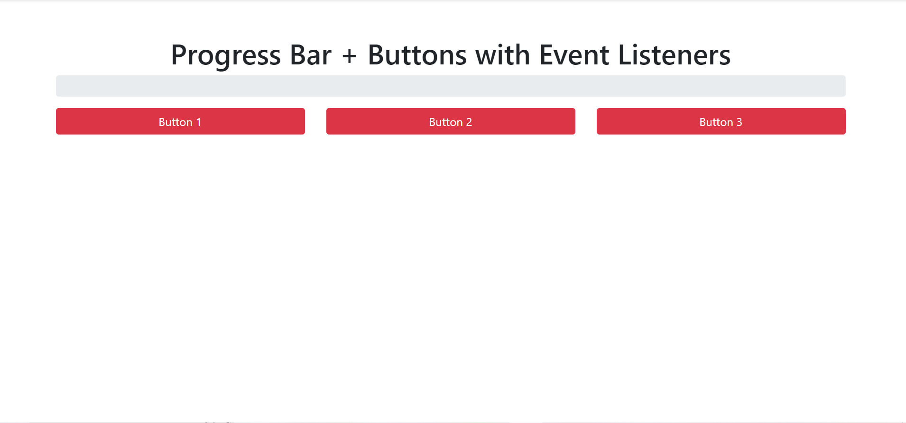
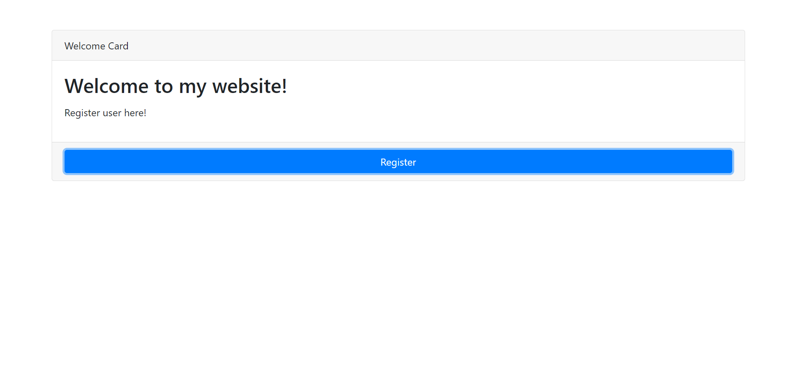
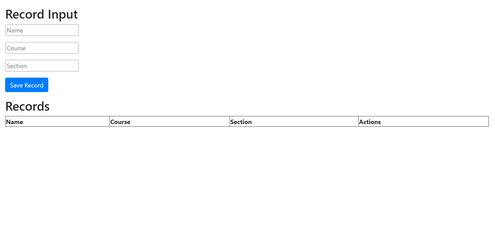

# MY-FINAL-PROJECT
<!DOCTYPE html>
<html lang="en">
<head>
  <meta charset="UTF-8">
  <meta name="viewport" content="width=device-width, initial-scale=1.0">
  <link rel="stylesheet" href="https://stackpath.bootstrapcdn.com/bootstrap/4.5.2/css/bootstrap.min.css">
  
  <title>My Portfolio</title>
</head>
<body>

  

    <h1>GITHUB - About Me Page</h1>
  

  

    

      

        

          

            
          

          <h2>THE ONE AND ONLY</h2>
          

            <button class="btn btn-primary">Anime</button>
            <button class="btn btn-primary">Playing</button>
            <button class="btn btn-primary">Sleeping</button>
            <button class="btn btn-primary">Eating</button>
          

          
Social Media Accounts:

          

            
            
          

          

            
Hello There This is my Portfolio 🚀

          

          

            <h3>Facts about me</h3>
            
Loves playing online games, playing badminton, sleeping, and learning new things.

          

        

      

      

        

          

            <h2>About Me</h2>
          

          

            
HI! I am Justin Paul I. Timosa, I'm an IT student and  a gamer.

            
<strong>Likes:</strong>

            <ul>
              <li>Watching anime</li>
              <li>Playing Badminton</li>
              <li>Playing Online games</li>
              <li>Eating</li>
              <li>Going outside</li>
              <li>Sleeping</li>
              <li>Reading Manga</li>
            </ul>
            

            
"Go confidently in the direction of your dreams. Live the life you have imagined.
              - Henry David Thoreau"

          

          

            <h3>&lt;Programming_Portfolio&gt;</h3>
          

          <!-- Display projects -->
          

            

              

                <!-- Project 1 -->
                

                  <h3 class="card-title">Project 1</h3>
                  
Jquery+Bootstrap+Midterm exam

                  
                  <a href="file:///C:/Users/User/Desktop/MYportfolio/TIMOSA_BootstrapJS_Act1.html" class="btn btn-primary view-project-link">View Project</a>
                

              

            

            

              

                <!-- Project 2 -->
                

                  <h3 class="card-title">Project 2</h3>
                  
Progress bar

                  
                  <a href="file:///C:/Users/User/Desktop/MYportfolio/TIMOSA_BootstrapJS_Act1.html" class="btn btn-primary view-project-link">View Project</a>
                

              

            

          

          

            

              

                <!-- Project 3 -->
                

                  <h3 class="card-title">Project 3</h3>
                  
Register

                  
                  <a href="file:///C:/Users/User/Downloads/Perez,%20Estayan,%20Timosa_BootStrap-JavaScript_Act2-2.html" class="btn btn-primary view-project-link">View Project</a>
                

              

            

            

              

                <!-- Project 4 -->
                

                  <h3 class="card-title">Project 4</h3>
                  
Record

                  
                  <a href="file:///C:/Users/User/Downloads/Estayan,%20Perez,%20Timosa_BootstrapAct3.html" class="btn btn-primary view-project-link">View Project</a>
                

              

            

          

        

      

    

  

</body>
</html>
